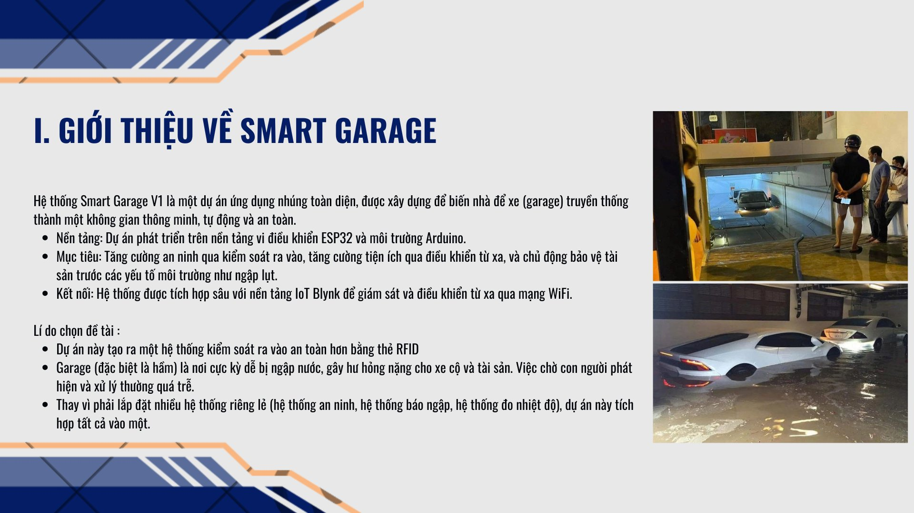
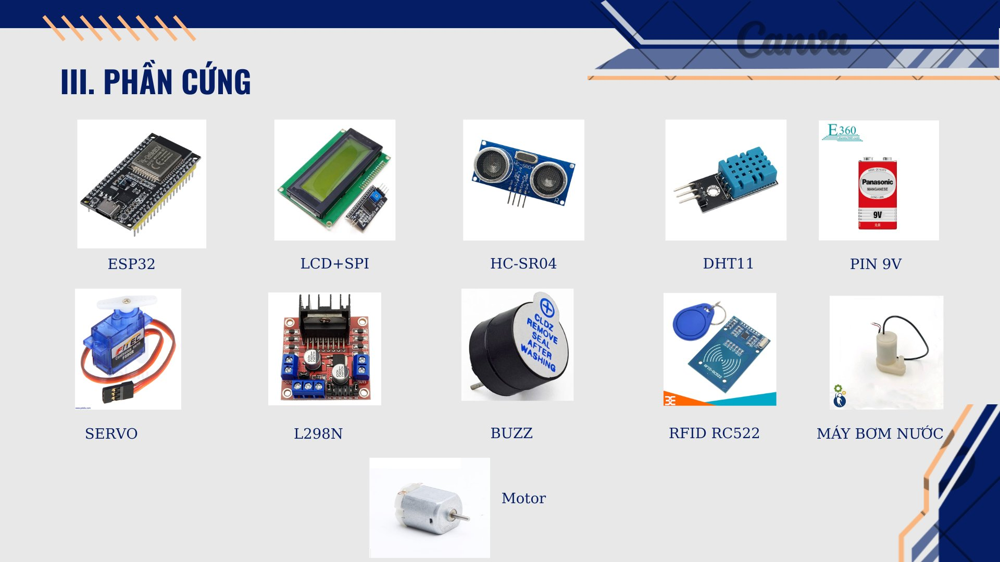
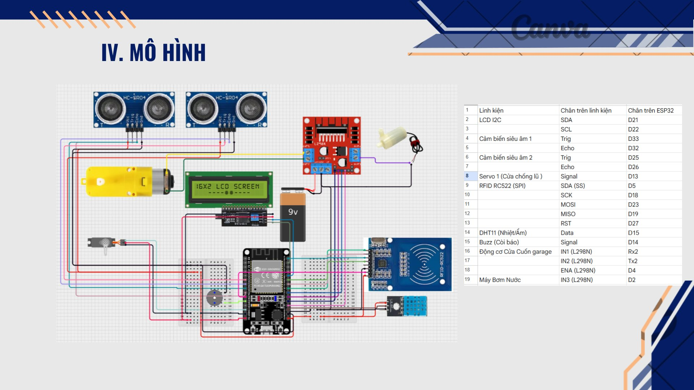

# 🚪 SmartGarageV2 – Hệ Thống Garage Thông Minh

## 1. Giới thiệu dự án

**SmartGarageV2** là phiên bản nâng cấp của hệ thống Smart Garage, một dự án ứng dụng nhúng được xây dựng trên nền tảng vi điều khiển **ESP32** và môi trường **Arduino**, nhằm biến một nhà để xe (garage) truyền thống thành một không gian thông minh, tự động và an toàn hơn.

Canva Link: https://canva.link/wn6i8pi35ebtml3 

Hệ thống tích hợp các tính năng chính:

- **Đóng/mở cửa garage bằng thẻ RFID** hoặc điều khiển từ xa qua ứng dụng **Blynk** (qua kết nối WiFi).
- **Cửa chống lũ** tự động đóng khi cảm biến phát hiện mực nước dâng quá mức cho phép tại khu vực ra vào.
- **Bơm chống ngập** tự động kích hoạt để bơm nước ra ngoài khi garage bị ngập.
- **Cảm biến nhiệt độ, độ ẩm (DHT11)** hiển thị trực tiếp lên màn hình LCD và đồng bộ dữ liệu lên ứng dụng Blynk để giám sát từ xa.

Toàn bộ hệ thống được kết nối với nền tảng IoT Blynk, cho phép người dùng theo dõi và điều khiển garage mọi lúc, mọi nơi chỉ với một chiếc điện thoại có kết nối Internet.

## 2. Lý do chọn dự án

- Garage, đặc biệt là garage hầm, là khu vực rất dễ bị ngập nước vào mùa mưa lũ, gây thiệt hại nặng cho xe cộ và tài sản. Việc chờ con người phát hiện và xử lý thủ công thường quá chậm, dẫn đến hậu quả đáng tiếc.
- Hệ thống kiểm soát ra vào bằng khóa cơ truyền thống dễ bị sao chép chìa khóa, kém an toàn; trong khi đó kiểm soát bằng thẻ RFID kết hợp điều khiển từ xa qua app giúp tăng tính an ninh và sự tiện lợi.
- Thay vì phải lắp đặt nhiều hệ thống rời rạc (an ninh, báo ngập, đo nhiệt độ - độ ẩm...), dự án hướng đến việc tích hợp tất cả các chức năng này vào một hệ thống duy nhất, dễ giám sát và vận hành thông qua một nền tảng IoT chung.
- Đây là cơ hội thực hành kiến thức về lập trình vi điều khiển, cảm biến, động cơ và kết nối IoT vào một sản phẩm có tính ứng dụng thực tế cao.

## 3. Linh kiện cần chuẩn bị

| STT | Linh kiện | Vai trò trong hệ thống |
|---|---|---|
| 1 | ESP32 | Vi điều khiển trung tâm, xử lý dữ liệu và kết nối WiFi/Blynk |
| 2 | Màn hình LCD 16x2 (kèm module I2C) | Hiển thị nhiệt độ, độ ẩm và trạng thái hệ thống |
| 3 | Module RFID RC522 + thẻ/chìa từ | Xác thực và điều khiển đóng/mở cửa garage |
| 4 | Cảm biến siêu âm HC-SR04 (x2) | Đo mực nước để phát hiện nguy cơ ngập lụt |
| 5 | Cảm biến nhiệt độ, độ ẩm DHT11 | Đo nhiệt độ và độ ẩm trong garage |
| 6 | Servo SG90 | Điều khiển cơ cấu cửa chống lũ |
| 7 | Động cơ DC (Motor) | Điều khiển cơ cấu đóng/mở cửa cuốn garage |
| 8 | Module L298N | Mạch cầu H điều khiển động cơ và máy bơm |
| 9 | Máy bơm nước mini | Bơm thoát nước khi garage bị ngập |
| 10 | Buzzer (còi báo) | Cảnh báo bằng âm thanh khi có sự cố |
| 11 | Pin 9V | Cấp nguồn cho động cơ/máy bơm |
| 12 | Breadboard và dây nối (jumper wire) | Kết nối các linh kiện trong mô hình thử nghiệm |

## 4. Sơ đồ mô hình kết nối

Sơ đồ dưới đây mô tả cách kết nối chi tiết giữa ESP32 và các module/cảm biến trong hệ thống SmartGarageV2:

## 5. Tác giả

Dự án được thực hiện bởi: **Long Nguyen**
